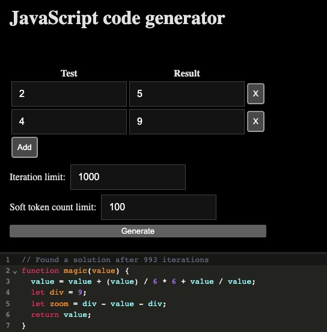
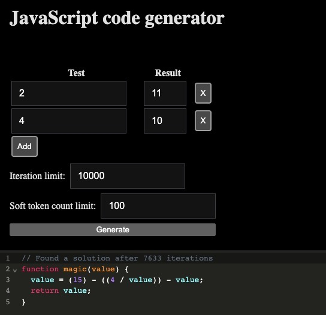
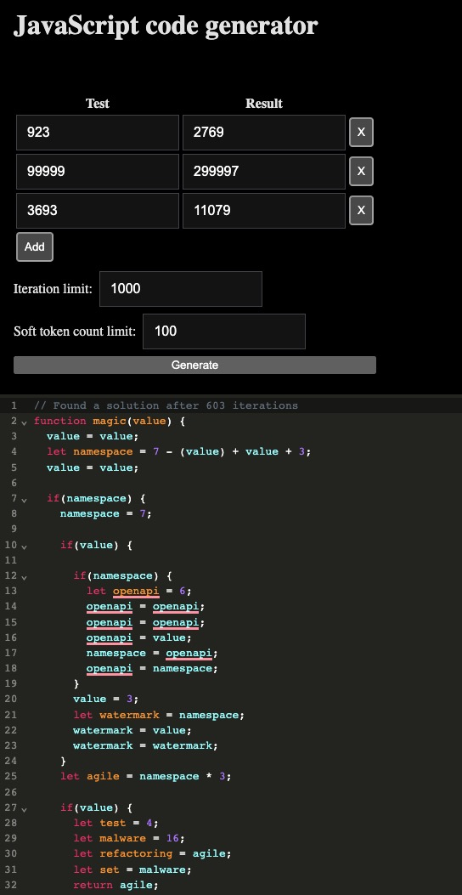

# Random code generator

Randomly generate JavaScript functions, until it accidentally finds a function
that passes all specified test cases.

[Live Demo](https://maxpatiiuk.github.io/code-generator/)







## Installation

Clone the repository:

```sh
git clone https://github.com/maxpatiiuk/code-generator
cd code-generator
```

Install dependencies:

```sh
npm install
```

Start the server:

```sh
npm run dev
```

This joke project came out of:

- Frustration with a test that keeps on failing
- A bet with a friend that this will work

## Documentation

Enter the expected input and output pairs and click "Generate".

It will try to randomly generate a JavaScript function until by chance it finds
a function that matches all specified test cases.

Note, the performance is horrible for all but trivial cases.

The "Iteration limit" parameter determines how many times it tries to generate

The "Soft token count limit" is responsible for making the random generator more
conservative (i.e avoid `if` statements and declaring new variables) as the
limit is approaching.

The random generator is implemented as simplified JavaScript syntax tree with
weights attached to branches of the tree.

See `syntaxTree` variable in [./src/generator/syntax.ts](./src/generator/syntax.ts)

No machine learning or fancy AI magic is used - pure randomness (it's about as efficient as [Bogosort](https://en.wikipedia.org/wiki/Bogosort))

See also, my programming language, [alia](https://github.com/maxpatiiuk/alia) and a [Google Calendar clone](https://github.com/maxpatiiuk/project-ephemeris).